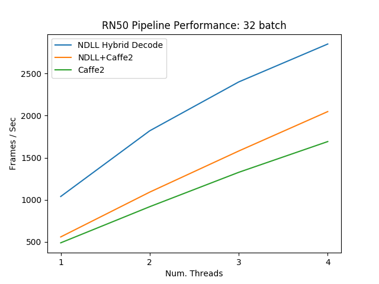
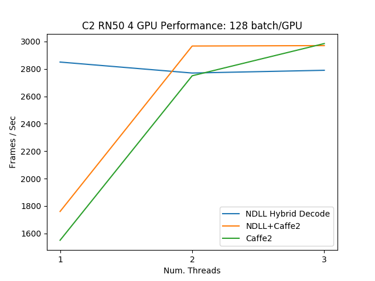
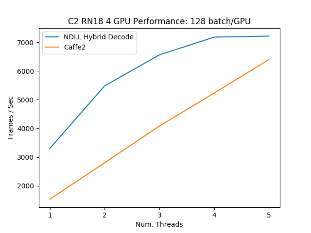

# NDLL (we should have a logo!)

NDLL is a collection of highly optimized building blocks and an execution engine to accelerate computer vision deep learning applications. The goal of NDLL is to provide both performance and flexibility, as a single library, that can be easily integrated into DL training and inference applications.

## Key features

- Full data pipeline accelerated from reading images on disk to getting ready for training/inference
- Flexibility through configurable graphs
- Support for image classification and segmentation workloads
- Ease of integration through direct framework plugins
- Portable training workflows with multiple input formats - JPEG images, LMDB, RecordIO, TFRecord

# Building and installing

## Prerequisities

- NVIDIA CUDA 9.0 or above
- [OpenCV](https://github.com/opencv/opencv) - we recommend version 3 or higher
- [libjpeg-turbo](https://github.com/libjpeg-turbo/libjpeg-turbo)
Note: In Ubuntu repositories libjpeg-turbo is distributed as 2 packages: `libjpeg-turbo` and `libturbojpeg`. In order to use NDLL one needs to install `libturbojpeg` package, but to compile NDLL both of them are required.
- [Protobuf](https://github.com/google/protobuf) - in order to read TensorFlow's TFRecord format version 3 is required
Note: Ubuntu 16.04 repository contains only version 2 of Protobuf. Ubuntu 18.04 repositories contain Protobuf version 3.
- libLMDB (optional: to read Caffe and Caffe2 LMDB formats)

## Binaries

TODO

## From source

### Install prerequisities

Please note, that if you use Ubuntu software repositories to install prerequisities of NDLL, you need to install both `libjpeg-turbo` and `libturbojpeg` packages for libjpeg-turbo.

### Get the NDLL source

```
git clone --recursive https://gitlab-dl.nvidia.com/tgale/ndll
cd ndll
```

### Make the build directory

```
mkdir build
cd build
```

### Compile NDLL

To build NDLL without LMDB support:

```
cmake ..
make -j"$(nproc)" install
```

To build NDLL with LMDB support:

```
cmake -DBUILD_LMDB=ON ..
make -j"$(nproc)" install
```

Optional CMake build parameters:

- `BUILD_PYTHON` - build Python bindings (default: ON)
- `BUILD_TEST` - include building test suite (default: ON)
- `BUILD_BENCHMARK` - include building benchmarks (default: ON)
- `BUILD_LMDB` - build with support for LMDB (default: OFF)
- `BUILD_NVTX` - build with NVTX profiling enabled (default: OFF)
- `BUILD_TENSORFLOW` - build TensorFlow plugin (default: OFF)

## Docker image

Dockerfile is supplied. To build:

```
docker build -t ndll -f Dockerfile
```

# Getting started

[`examples`](examples) directory contains a series of examples (in the form of Jupyter notebooks) of different features of NDLL. It also contains examples of how to use NDLL to interface with DL frameworks.


# OLD

## Documentation
The code is heavily documented. Run `doxygen Doxyfile` to build the documentation.

## Build
`mkdir build && cd build && cmake -DCMAKE_BUILD_TYPE=Release -DUSE_NVTX=OFF -DBUILD_TEST=ON -DBUILD_BENCHMARK=ON -DBUILD_PYTHON=ON -DBUILD_LMDB=ON .. && make -j 20 install`

Note: NDLL has submodules (gtest & google benchmark). Use `--recursive` when cloning the repo.

## Results
See experimental NDLL+Caffe2 integration [here.](https://gitlab-dl.nvidia.com/dgx/caffe2/tree/17.11-devel-ndll)

Standalone Data Loader Performance:


ResNet-50 Performance:


ResNet-18 Performance:


Notes:
- Hybrid jpeg decode is very fast but has significant overhead, mostly due to cudaLaunch latency (>50% of the overhead w/ 32 batch size). This can be reduced significantly by moving to cudaLaunchKernel to launch non-batched kernels, and by eventually replacing the single-image resize & yuv->rgb kernels with batched version.
- NDLL currently pre-sizes buffers to avoid synchronous memory allocations and slow startup time. We're looking into moving to caching allocators for host & device to remove the need for this and avoid wasteful memory allocation.
- NDLL Hybrid decode uses significantly more GPU memory than the normal CPU pipeline. This can be reduced with some memory optimizations in the Pipeline class.
