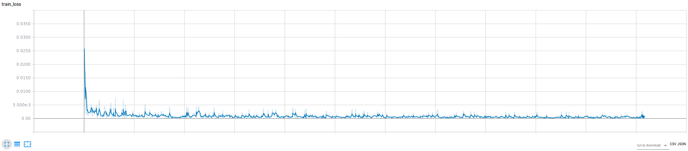
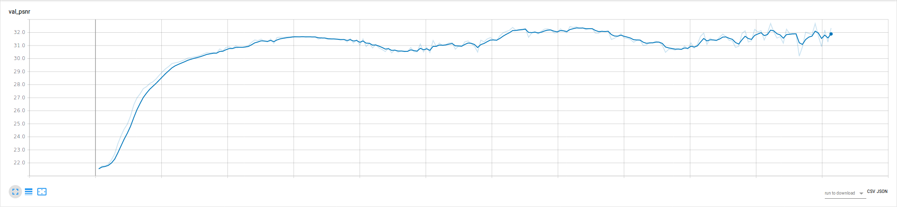

Video Super-Resolution
======================

In this example we use DALI with the VideoReader operator to supply data for training a video super-resolution network implemented in `PyTorch <https://github.com/pytorch/pytorch>`_.  We replicate the network described in `End-to-End Learning of Video Super-Resolution with Motion Compensation <https://arxiv.org/abs/1707.00471>`_.

The network implemented, VSRNet, uses an odd number of successive frames randomly sampled from a video as input.  The outer frames are warped to align with the center frame using a pretrained optical flow network FlowNetSD [2]. The warped frames are then passed to a convolutional network that predicts a single higher resolution version of the center frame.

We make a number of small modifications to the network that we found improved the convergence
rate, e.g. batch normalization, Adam optimizer, cyclic learning rate policy.

Single node single-gpu is supported, fp32 and fp16 training are supported.

Dataloaders
-----------

Two data loader options are provided for comparison:

* DALI allows random access to frame sequences directly from .mp4 files and augmentation with DALI operators
* A standard PyTorch dataloader loads frames from individual .png files

These dataloaders can be found in dataloading/dataloaders.py.

Data Loader Performance
-----------------------

We present performance characteristics of DALI, NVVL standalone, and a standard .png data loader
for a number of VSRNet training scenarios. In all cases we find that DALI offers
reduced CPU load, host memory usage, disk usage and per iteration data loading
time.

.. list-table::
   :header-rows: 1

   * - Data loader
     - Input resolution
     - Crop size*
     - Batch size
     - Disk space for dataset(GB)
     - Per iteration data time (ms)
   * - DALI
     - 720p
     - 540p
     - 3
     - 0.961
     - 0.28
   * - NVVL
     - 720p
     - 540p
     - 3
     - 0.961
     - 0.28
   * - .png
     - 720p
     - 540p
     - 3
     - 38
     - 2.66

* Random cropping

Requirements
------------

The system used to run this project must include two or more Kepler, Pascal, Maxwell or Volta NVIDIA GPUs.

Software requirements:

* CUDA 9.0+
* PyTorch 0.4+
* FFmpeg=3.4.2
* scikit-image
* tensorflow
* tensorboard
* tensorboardX

FlowNet2-SD Implementation and Pre-trained Model
------------------------------------------------

We make use of the FlowNet2-SD PyTorch implementation available `here <https://github.com/NVIDIA/flownet2-pytorch>`_.  It is included in this repo as a git submodule.

In order to use the pre-trained FlowNet2-SD network run the following from the
root directory of this repo:

.. code-block:: bash

   git clone https://github.com/NVIDIA/flownet2-pytorch.git
   pushd flownet2-pytorch
   git checkout 6a0d9e70a5dcc37ef5577366a5163584fd7b4375
   popd

Training the VSRNet implemented here requires the use of pre-trained weights from the FlowNet2-SD network.  We provided a converted Caffe pre-trained model below.  Should you use these weights, please adhere to the `license agreement <https://drive.google.com/file/d/1TVv0BnNFh3rpHZvD-easMb9jYrPE2Eqd/view?usp=sharing>`_\ :

`FlowNet2-SD <https://drive.google.com/file/d/1QW03eyYG_vD-dT-Mx4wopYvtPu_msTKn/view?usp=sharing>`_\ [173MB]

The default location that the training code will look for these weights is ``flownet2-pytorch/networks/FlowNet2-SD_checkpoint.pth.tar``. This location can be changed via the ``--flownet_path`` argument to ``main.py``.

Data
----

`Makansi et al. <https://arxiv.org/abs/1707.00471>`_ uses the `Myanmar 60p video` as
its raw data source. It is a 60 FPS, 4K resolution cinematic video.

Example preparation steps can be found `here
<https://github.com/NVIDIA/nvvl/tree/master/examples/pytorch_superres>`_.

Training
--------

Training can be run by running the following command available in :fileref:`docs/examples/use_cases/video_superres/run.sh`:

.. code-block:: bash

   ./run.sh

This file allows configuration of a variety of
training options - it is expected that you will modify data paths appropriately
for your system.

Visualization of training data, e.g. loss curves and timings, as well as sample images is provided through `Tensorboard <https://www.tensorflow.org/programmers_guide/summaries_and_tensorboard>`_ via the `tensorboardX <https://github.com/lanpa/tensorboard-pytorch>`_ library.  Whilst training is running you can access Tensorboard at ``<host_ip>:6006``.

Results on Myanmar Validation Set
---------------------------------

All testing of this project was carried out on an NVIDIA DGX-1 using all 8 V100 GPUs and running CUDA 9.1, PyTorch 0.4.0a0+02b758f, cuDNN v7.0.5 in Ubuntu 16.04 Docker containers.

Input image (128x240 - click to see actual size):

VSRNet prediction (512x960 - click to see actual size):

Example training loss (fp16, batch size 7, min_lr=max_lr=0.001):

Example validation PSNR (fp16, batch size 7, min_lr=max_lr=0.001)

Reference
---------

If you find this implementation useful in your work, please acknowledge it appropriately and cite the following papers:

.. code-block:: BibTeX

   @InProceedings{IB17,
     author       = "O. Makansi and E. Ilg and and Thomas Brox",
     title        = "End-to-End Learning of Video Super-Resolution with Motion
                     Compensation",
     booktitle    = "German Conference on Pattern Recognition (GCPR) 2017",
     month        = " ",
     year         = "2017",
     url          = "http://lmb.informatik.uni-freiburg.de/Publications/2017/IB17"
   }

.. code-block:: BibTeX

   @InProceedings{IMKDB17,
     author       = "E. Ilg and N. Mayer and T. Saikia and M. Keuper and A.
                     Dosovitskiy and T. Brox",
     title        = "FlowNet 2.0: Evolution of Optical Flow Estimation with
                     Deep Networks",
     booktitle    = "IEEE Conference on Computer Vision and Pattern Recognition
                     (CVPR)",
     month        = "Jul",
     year         = "2017",
     url          = "http://lmb.informatik.uni-freiburg.de//Publications/2017/IMKDB17"
   }

This example and this README are based on `NVVL's PyTorch example <https://github.com/NVIDIA/nvvl/tree/master/examples/pytorch_superres>`_.
