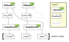

.. _pipeline:

Pipeline
========

.. currentmodule:: nvidia.dali

In DALI, any data processing task has a central object called Pipeline. Pipeline object is an
instance of :class:`nvidia.dali.Pipeline` or a derived class. Pipeline encapsulates the
data processing graph and the execution engine.

You can define a DALI Pipeline in the following ways:

#. By implementing a function that uses DALI operators inside and decorating it with the :meth:`pipeline_def` decorator.
#. By instantiating :class:`Pipeline` object directly, building the graph and setting the pipeline outputs with :meth:`Pipeline.set_outputs`.
#. By inheriting from :class:`Pipeline` class and overriding :meth:`Pipeline.define_graph` (this is the legacy way of defining DALI Pipelines).

Data Processing Graphs
----------------------

DALI pipeline is represented as a graph of operations. There are two kinds of nodes in the graph:

 * Operators - created on each call to an operator
 * Data nodes (see :class:`~nvidia.dali.pipeline.DataNode`) - represent outputs and inputs of operators; they are
   returned from calls to operators and passing them as inputs to other operators establishes
   connections in the graph.

The data nodes can be transformed by calling :ref:`operator functions<operation reference>`.
They also support Python-style :ref:`indexing<Indexing>` and can be incorporated in
:ref:`mathematical expressions<mathematical expressions>`.

Example::

    @pipeline_def  # create a pipeline with processing graph defined by the function below
    def my_pipeline():
        """ Create a pipeline which reads images and masks, decodes the images and
            returns them. """
        img_files, labels = fn.readers.file(file_root="image_dir", seed=1)
        mask_files, _ = fn.readers.file(file_root="mask_dir", seed=1)
        images = fn.decoders.image(img_files, device="mixed")
        masks  = fn.decoders.image(mask_files, device="mixed")
        return images, masks, labels

    pipe = my_pipeline(batch_size=4, num_threads=2, device_id=0)

The resulting graph is:

.. _processing_graph_structure:

.. important::
    The pipeline definition function is excuted only once, when the pipeline is built,
    and typically returns a ``dali.DataNode`` object or a tuple of thereof.
    For convenience, it's possible to return other types, such as NumPy arrays, but those
    are treated as constants and evaluated only once.

Processing Graph Structure
^^^^^^^^^^^^^^^^^^^^^^^^^^

DALI pipelines are executed in stages. The stages correspond to the ``device`` parameter
that can be specified for the operator, and are executed in following order:

#. ``'cpu'`` - operators that accept CPU inputs and produce CPU outputs.
#. ``'mixed'`` - operators that accept CPU inputs and produce GPU outputs, for example :meth:`nvidia.dali.fn.decoders.image`.
#. ``'gpu'`` - operators that accept GPU inputs and produce GPU outputs.

Data can be transferred between CPU and GPU by calling ``.gpu()`` and ``.cpu()``
on a :class:`~nvidia.dali.pipeline.DataNode` (an output of a DALI operator).

Most DALI operators accept additional keyword arguments used to parametrize their behavior.
Those named keyword arguments (which are distinct from the positional inputs) can be:

  * Python constants
  * Argument inputs - outputs of the **CPU** operators - indicated as `TensorList` in the operator's docstring.

In the case of argument inputs, passing output of one operator as a **named keyword argument**
of other operator will establish a connection in the processing graph.

Those parameters will be computed as a part of DALI pipeline graph every iteration and
for every sample.

Example::

    @pipeline_def
    def my_pipeline():
        img_files, labels = fn.readers.file(file_root='image_dir', device='cpu')
        # `images` is GPU data (result of Mixed operator)
        images = fn.decoders.image(img_files, device='mixed')
        # `coin_flip` must be on CPU so the `flip_params` can be used as argument input
        flip_param = fn.random.coin_flip(device='cpu')
        # `images` is input (GPU) and `flip_param` is argument input (CPU)
        flipped = fn.flip(images, horizontal=flip_param, device='gpu')
        # `labels` is explicitly marked for transfer to GPU, `flipped` is already GPU
        return flipped, labels.gpu()

    pipe = my_pipeline(batch_size=4, num_threads=2, device_id=0)

.. note::
    If the ``device`` parameter is not specified, it is selected automatically based on the
    placement of the inputs. If there is at least one GPU input, the ``device='gpu'`` is assumed,
    otherwise ``'cpu'`` is used.

    The example above adds ``device`` parameter explicitly for clarity, but it would work the same
    if only ``device='mixed'`` was specified for ``fn.decoders.image``.

Current Pipeline
----------------

Subgraphs that do not contribute to the pipeline output are automatically pruned.
If an operator has side effects (e.g. ``PythonFunction`` operator family), it cannot be invoked
without setting the current pipeline. Current pipeline is set implicitly when the graph is
defined a function decorated with :meth:`pipeline_def` or in :meth:`Pipeline.define_graph` method.
Otherwise, it can be set using context manager (``with`` statement)::

    pipe = dali.Pipeline(batch_size=N, num_threads=3, device_id=0)
    with pipe:
        src = dali.ops.ExternalSource(my_source, num_outputs=2)
        a, b = src()
        pipe.set_outputs(a, b)

When creating a pipeline with :meth:`pipeline_def`, the function which defines the pipeline is
executed within the scope of the newly created pipeline. The following example is equivalent
to the previous one::

    @dali.pipeline_def(batch_size=N, num_threads=3, device_id=0)
    def my_pipe(my_source):
        return dali.fn.external_source(my_source, num_outputs=2)

    pipe = my_pipe(my_source)

.. _pipeline_decorator:

Pipeline Decorator
------------------
.. autodecorator:: pipeline_def

.. _conditional_execution:

Conditional Execution
---------------------

DALI allows to execute operators conditionally for selected samples within the batch using
``if`` statements. To enable this feature use the
:py:func:`@pipeline_def <nvidia.dali.pipeline_def>` decorator to define the pipeline and
set ``enable_conditionals`` to ``True``.

Every ``if`` statement that have a :meth:`~nvidia.dali.pipeline.DataNode` as a condition
will be recognized as DALI conditional statement.

For example, this pipeline rotates each image with probability of 25% by a random angle between
10 and 30 degrees::

    @pipeline_def(enable_conditionals=True)
    def random_rotate():
        jpegs, _ = fn.readers.file(device="cpu", file_root=images_dir)
        images = fn.decoders.image(jpegs, device="mixed")
        do_rotate = fn.random.coin_flip(probability=0.25, dtype=DALIDataType.BOOL)
        if do_rotate:
            result = fn.rotate(images, angle=fn.random.uniform(range=(10, 30)), fill_value=0)
        else:
            result = images
        return result

The semantics of DALI conditionals can be understood as if the code processed one sample at a time.

The condition must be represented by scalar samples - that is have a 0-d shape. It can be either
boolean or any numerical type supported by DALI - in the latter case, non-zero values are considered
True and zero values considered False, in accordance with typical Python semantics.

Additionally, logical expressions ``and``, ``or``, and ``not`` can be used on
:meth:`~nvidia.dali.pipeline.DataNode`. The first two are restricted to boolean inputs, ``not``
allows the same input types as ``if`` statement condition. Logical expression follow the
shortcutting rules when they are evaluated.

You can read more in the `conditional tutorial <examples/general/conditionals.html>`_.

Preventing AutoGraph conversion
^^^^^^^^^^^^^^^^^^^^^^^^^^^^^^^

.. autodecorator:: nvidia.dali.pipeline.do_not_convert

.. _pipeline_class:

Pipeline class
--------------

.. autoclass:: Pipeline
   :members:
   :special-members: __enter__, __exit__

DataNode
--------
.. autoclass:: nvidia.dali.pipeline.DataNode
   :members:

Experimental Pipeline Features
------------------------------
Some additional experimental features can be enabled via the special variant of the pipeline
decorator.

.. autodecorator:: nvidia.dali.pipeline.experimental.pipeline_def

Pipeline Debug Mode (experimental)
^^^^^^^^^^^^^^^^^^^^^^^^^^^^^^^^^^

Pipeline can be run in debug mode by replacing ``@nvidia.dali.pipeline_def`` decorator with its
experimental variant ``@nvidia.dali.pipeline.experimental.pipeline_def`` and setting parameter
``debug`` to True. It allows you to access and modify data inside the pipeline execution graph,
as well as use non-DALI data types as inputs to the DALI operators.

In this mode outputs of operators are of type ``DataNodeDebug`` which is an equivalent to
``DataNode`` in the standard mode. You can perform the same operations on objects of type
``DataNodeDebug`` as on ``DataNode``, that includes arithmetic operations.

Use ``.get()`` to access data associated with the ``DataNodeDebug`` object during current execution
of :meth:`Pipeline.run`::

    @nvidia.dali.pipeline.experimental.pipeline_def(debug=True)
    def my_pipe():
        data, _ = fn.readers.file(file_root=images_dir)
        img = fn.decoders.image(data)
        print(np.array(img.get()[0]))
        ...

Use non-DALI data types (e.g. NumPy ndarray, PyTorch Tensor) directly with DALI operators::

    @nvidia.dali.pipeline.experimental.pipeline_def(batch_size=8, debug=True)
    def my_pipe():
        img = [np.random.rand(640, 480, 3) for _ in range(8)]
        output = fn.flip(img)
        ...

Notice
~~~~~~

* Seed generation in debug mode works differently than in standard mode (it is deterministic but
  different). If you want to achieve the same results in debug mode as in standard mode initialize
  operators with the ``seed`` parameter.
* Direct calls to operators work only in a scope of the ``pipeline_def`` function, you cannot use
  them this way outside of ``pipeline_def``.
* You cannot change the order of operators inside the pipeline between the iterations.

.. warning::
    Using debug mode will drastically worsen performance of your pipeline. Use it only for
    debugging purposes.

.. note::
    This feature is experimental and its API might change without notice.